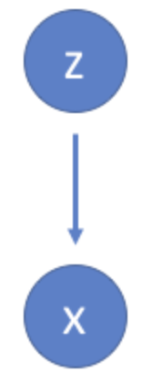

# Variational Auto Encoders  (VAEs)

## Introduction
In this lesson, we will focus on variational autoencoders (VAEs). A VAE is a generative model as it estimates the Probability Density Function (PDF) of the training data. If such a model is trained on natural looking images of cats, it should assign a high probability value to an image of a cat considering all of its possible variations. An image of random gibberish on the other hand should be assigned a low probability value.

The VAE model can also sample examples from the learned PDF, allowing it to be able to generate new examples that look similar to the original dataset!

> __Variational Autoencoders (VAEs) allow us to formalize this problem in the framework of probabilistic graphical models where we are maximizing a lower bound on the log likelihood of the data.__

## Objectives
You will be able to:

- Differentiate VAEs from standard AEs
- Explain the role of variational Inference used by VAEs
- Develop an intuition around KL-divergence and how it allows us to have a continuous latent space
- Understand Re-parameterization trick to create new unseen samples from latent space

## What are VAEs ?
As compared to the common uses of neural networks as regressors or classifiers, VAEs are powerful generative models. They have been shown to produce excellent results for complex applications from generating fake human faces, to producing purely synthetic music.

Generative models like VAEs are known to generate a random, previously unseen output, that looks similar to the training data. More often, we would like to explore variations on data we already have, not just in a random way either, but in a specific direction. In the example below, a deep architecture has been used to apply different variations to facial data. You may have seen such architectures behind facebook apps etc. This is one domain where VAEs shine are offer state of the art performance for different types of complex real world data.

Like all other AEs we looked at earlier, VAEs are primarily used for **unsupervised learning of hidden representations**. However, VAEs differ from AEs in that they approach the problem from a probabilistic perspective i.e. VAEs specify a joint distribution over the observed and latent variables, and approximate the posterior conditional density over latent variables with variational inference, using an **Inference Network** to reduce the cost of inference.

## Limitations of Standard (non-variational) AEs

Standard AEs learn to generate compact representations and reconstruct their inputs well. Asides from a few applications like data compression and denoising , their usage remains fairly limited. The limitations in AEs are mainly due to the face they convert their inputs to the the latent space and this is where their encoded vectors lie. This latent space may not be continuous and thus it may not easy to interpolate through it. For example, When training an AE on the MNIST dataset, and visualizing the encodings from a 2 dimensional latent space shows distinct clusters based on classes in the dataset as shown below.

These are expected results as distinct encodings for each image type makes it far easier for the decoder to decode them. For image compression and regeneration, this is perfectly fine.

The limitation in AEs arise when we want to build a generative model as we would not want to exactly replicate the same data (image) we put in. Rather, we want to randomly sample from the latent space, or generate variations on an input image, from a **continuous** latent space.

If the space has discontinuities (eg. gaps between clusters as shown above) and we try to generate a variation from there, the decoder will generate an unrealistic output, because the decoder has no idea how to deal with that region of the latent space. During training, it never saw encoded vectors coming from that region of latent space. In the example above , the network can not learn what variations to apply to digit `1` from a cluster to make it look similar to a `7` which is found in another cluster - and vice versa. This is due to discontinuity between these clusters.  A VAE would offer a continuous latent space to produce a variational output as shown below:

## Statistical Motivation for VAEs

Following the intuition for AEs, suppose that there exists some hidden variable $z$ which generates an observation $x$.

As we get the output $x$, we would like to infer the characteristics of $z$. In other words, we’d like to compute $P(z|x)$ using Bayesian Inference as below:

$$P(z|x) = \frac{P(x|z)P(z)}{P(x)}$$

We already know that computing $P(x)$ is quite difficult. For a continuous distribution we integrate over all sample partitions as below:

$$ P\left( x \right) = \int {P\left( {x|z} \right)P\left( z \right)dz}$$

i.e. that is, we marginalize out $z$ from the joint probability distribution $P(x|z)$.

With VAEs, we can apply a variational inference to estimate this value. We can approximate $P(z|x)$ by considering another distribution $Q(z|x)$ which we'll define such that it has a **tractable distribution**. We define parameters of $Q(z|x)$ such that it is very similar to $P(z|x)$, we can use it to perform approximate inference of the intractable distribution.

> __A distribution is called tractable if any marginal probability induced by it can be computed in linear time__

The idea of VAE is to infer $P(z)$ using $P(z|X)$ i.e. we want to make our latent variable **likely** under our data. Talking in term of our MNIST example, we want to limit our imagination only on valid digits.

### Variational Inference

First, we have to infer the distribution $P(z|x)$, as we don’t know it yet. In VAE, we infer $P(z|x)$ using a method called **Variational Inference (VI)**. VI is one of the popular choice of method in Bayesian inference, the other one being Monte-carlo Markov Chains method.

> The Variational Inference sets the inferencing as an optimization problem, by modeling the true distribution $P(z|x)$ using a simpler Gaussian distribution that is easy to evaluate, and minimize the difference between those two distribution using **KL divergence metric**, which tells us how different are P and Q.

### Kullback - Leibler (KL) Divergence

The KL divergence tells us how well the probability distribution $Q$ approximates the probability distribution $P$ by calculating the cross-entropy minus the entropy.

$$D_{KL} (P||Q) = H(P,Q) - H(P)$$

It is a non-negative and asymmetric measure. The KL divergence is used to force the distribution of latent variables to be a normal distribution so that we can sample latent variables from the normal distribution. As such, the KL divergence is included in the loss function to improve the similarity between the distribution of latent variables and the normal distribution. [Visit this link](https://towardsdatascience.com/demystifying-kl-divergence-7ebe4317ee68) for details on KL divergence and its mathematical derivation. Below we'll put this into practice to calculate our loss function.

So If we want to infer $P(z|x)$ using $Q(z|x)$,  The KL divergence $D_{KL}$ is formulated as follows:

$$D_{KL}[Q(z | x) || P(z | x)] = \sum_z Q(z | x) \, \log \frac{Q(z |x)}{P(z |x)}$$
                            $$= E \left[ \log \frac{Q(z |x)}{P(z |x)} \right] \\[10pt]$$
                            $$= E[\log Q(z | x) - \log P(z |x)]$$

In the equations above, we haven't used $P(X)$, $P(X|z)$, and $P(z)$. But, with Bayes’ rule, we could make these appear in the equation as below:

$$D_{KL}[Q(z \vert x) \Vert P(z \vert x)] = E \left[ \log Q(z \vert x) - \log \frac{P(x \vert z) P(z)}{P(x)} \right] \\[10pt]$$
                                        $$= E[\log Q(z \vert x) - (\log P(x \vert z) + \log P(z) - \log P(x))] \\[10pt]$$
                                        $$= E[\log Q(z \vert x) - \log P(x \vert z) - \log P(z) + \log P(x)]$$

The expectation $E$ is over $z$ and $P(x)$ doesn’t depend on $z$, so we could move it outside of the expectation.

$$D_{KL}[Q(z \vert x) \Vert P(z \vert x)] = E[\log Q(z \vert x) - \log P(x \vert z) - \log P(z)] + \log P(x) \\[10pt]$$
$$D_{KL}[Q(z \vert x) \Vert P(z \vert x)] - \log P(x) = E[\log Q(z \vert x) - \log P(x \vert z) - \log P(z)]$$

On the R.H.S of the equation could be rewritten as another KL divergence. So let’s do that by first rearranging the sign.

$$D_{KL}[Q(z \vert x) \Vert P(z \vert x)] - \log P(x) = E[\log Q(z \vert x) - \log P(x \vert z) - \log P(z)] \\[10pt]$$
$$\log P(x) - D_{KL}[Q(z \vert x) \Vert P(z \vert x)] = E[\log P(x \vert z) - (\log Q(z \vert x) - \log P(z))] \\[10pt]$$
                                       $$= E[\log P(x \vert z)] - E[\log Q(z \vert x) - \log P(z)] \\[10pt]$$
                                       $$= E[\log P(x \vert z)] - D_{KL}[Q(z \vert x) \Vert P(z)]$$

And this is our Variational Objective function. The first term $ E[\log P(x \vert z)]$ represents the reconstruction likelihood and the second term $D_{KL}[Q(z \vert x) \Vert P(z)]$ ensures that our learned distribution $Q$ is similar to the true prior distribution $P$.

At this point, we have:

- $Q(z|x)$ that project our data $x$ into latent variable space $z$.
- The latent variable $P(x|z)$ that generate data given latent variable.

### Introducing a Neural Architecture
We can use $Q$ to infer the possible hidden latent state which was used to generate an observation. We can further construct this model into a neural network architecture where the encoder model learns a mapping from $x$ to $z$ and the decoder model learns a mapping from $z$ back to $x$ as shown below:

### Network Loss

The loss function for this network will consist of two terms, one which penalizes reconstruction error (which can be thought of maximizing the reconstruction likelihood as discussed earlier) and a second term which encourages our learned distribution $Q(z|x)$ to be similar to the true prior distribution $P(z)$, which follows a unit Gaussian distribution, for each dimension $j$ of the latent space.

$${\cal L}\left( {x,\hat x} \right) + \sum\limits_j {KL\left( {{q_j}\left( {z|x} \right)||p\left( z \right)} \right)}$$

## VAEs and Continuous Latent Space

VAEs offer a unique feature that separates them from AEs and makes them suitable for generative modelling i.e. **their latent spaces are continuous**, allowing easy random sampling and interpolation.

Rather than directly outputting values for the latent state as in a standard autoencoder, VAE outputs parameters **describing a distribution for each dimension in the latent space**. Since we're assuming that our prior follows a normal distribution, we'll output two vectors describing the mean and variance of the latent state distributions. If we were to build a true multivariate Gaussian model, we'd need to define a covariance matrix describing how each of the dimensions are correlated. However, we'll make a simplifying assumption that our covariance matrix only has nonzero values on the diagonal, allowing us to describe this information in a simple vector.

The decoder model will then generate a latent vector by sampling from these defined distributions and proceed to develop a reconstruction of the original input.

This arrangmenet is shown in the image below:

### Re-parameterization Trick
When training the model, we need to be able to calculate the relationship of each parameter in the network with respect to the final output loss using **backpropagation**. However, we simply cannot do this for a random sampling process. Fortunately, we can leverage a clever idea known as the **Reparameterization trick**.  

> Re-parameterization allows us to randomly sample $ε$ from a unit Gaussian, and then shift the randomly sampled $ε$ by the latent distribution's mean $μ$ and scale it by the latent distribution's variance $σ$.

With re-parameterization, we can optimize the parameters of the distribution while still maintaining the ability to randomly sample from that distribution.

In order to deal with the fact that the network may learn negative values for $σ$, we'll typically have the network learn $log(σ)$ and exponentiate this value to get the latent distribution's variance.

### Visualizing Latent Space with VAEs

The main benefit of a variational autoencoder is that **we can learn smooth latent state representations of the input dat**a.

As we stated earlier, For standard autoencoders, we simply need to learn an encoding which allows us to reproduce the input. As you can see in the left-most figure, focusing only on reconstruction loss does allow us to separate out the classes (in this case, MNIST digits) which should allow our decoder model the ability to reproduce the original handwritten digit, but there's an uneven distribution of data within the latent space. In other words, **there are areas in latent space which don't represent any of our observed data.**

If we only focus only on ensuring that the latent distribution is similar to the prior distribution (through our KL divergence loss term), we end up describing every observation using the same unit Gaussian, which we subsequently sample from to describe the latent dimensions visualized. This effectively treats every observation as having the same characteristics; in other words, we've failed to describe the original data. This behavious is shown in the middle image below.

When the two terms are optimized simultaneously, we're able to describe the latent state for an observation with distributions close to the prior but deviating when necessary to describe salient features of the input. This is shown in the image on the right below.

The equilibrium reached by the cluster-forming nature of the reconstruction loss, and the dense packing nature of the KL loss, forms distinct clusters the decoder can decode. This means when randomly generating, if you sample a vector from the same prior distribution of the encoded vectors, $N(0, I)$, the decoder will successfully decode it. And if we are interpolating, there are no sudden gaps between clusters, but a smooth mix of features a decoder can understand.

The stochastic generation means, that even for the same input, while the mean and standard deviations remain the same, the actual encoding will somewhat vary on every single pass simply due to sampling as shown below:

The mean vector controls where the encoding of an input should be centered around, while the standard deviation controls the “area” i.e. how much from the mean the encoding can vary. As encodings are generated at random, the decoder learns that not only is a single point in latent space referring to a sample of that class, but all nearby points refer to the same as well. This allows the decoder to not just decode single, specific encodings in the latent space (leaving the decodable latent space discontinuous), but ones that slightly vary too, as the decoder is exposed to a range of variations of the encoding of the same input during training.

If the latent distributions appear to be very tight, we may decide to give higher weight to the KL divergence term with a parameter $β>1$, encouraging the network to learn broader distributions.

## Generating New Data from VAEs

By sampling the latent space, we can use the decoder network to form a generative model capable of creating new data similar to what was observed during training. Specifically, we'll sample from the prior distribution $P(z)$ which we assumed follows a unit Gaussian distribution.

The figure below visualizes the data generated by the decoder network of a variational autoencoder trained on the MNIST handwritten digits dataset. Here, we've sampled a grid of values from a two-dimensional Gaussian and displayed the output of our decoder network.

Above, we can see that the distinct digits each exist in different regions of the latent space and smoothly transform from one digit to another. This smooth transformation can be quite useful when you'd like to interpolate between two observations. In our next lab, we will use MNIST dataset to generate a similar output using deep Convolutional Autoencoder.

## Additional Resources
Due to the complex nature of practical VAEs, you are advised to visit following external resources to get a better understanding of all the new terms introduced in this lesson.
- [Using VAEs to learn variation in data](https://news.sophos.com/en-us/2018/06/15/using-variational-autoencoders-to-learn-variations-in-data/) - all about variation learning

- [KL Divenrgence Explained](https://www.countbayesie.com/blog/2017/5/9/kullback-leibler-divergence-explained) - Deep dive into maths behind KL divergence

- [Coursera video: Re-parameterization Trick](https://www.coursera.org/lecture/bayesian-methods-in-machine-learning/reparameterization-trick-ldVmL)

- [Conditional generation via Bayesian optimization in latent space](http://krasserm.github.io/2018/04/07/latent-space-optimization/)

- [Creating new celebrity faces](https://github.com/yzwxx/vae-celebA) - interesting project on github (in tensorflow)

- [Youtube : Face generator output demo](https://www.youtube.com/watch?v=Q1XuXwPVFko)

## Summary

In this lesson, we looked at VAEs and how they differ from AEs in terms of discrete vs. continuous latent space. We looked at the notion of "variation" in a continuous latent space and studied the role of KL-divergence towards setting up a loss function to generate new data samples similar to input data. We also focused on the clustering as a way to develop an intuition for VAEs. In our next lab, we will look at developing a deep convolutional autoencoder to generate new digits using MNIST dataset as input.  
